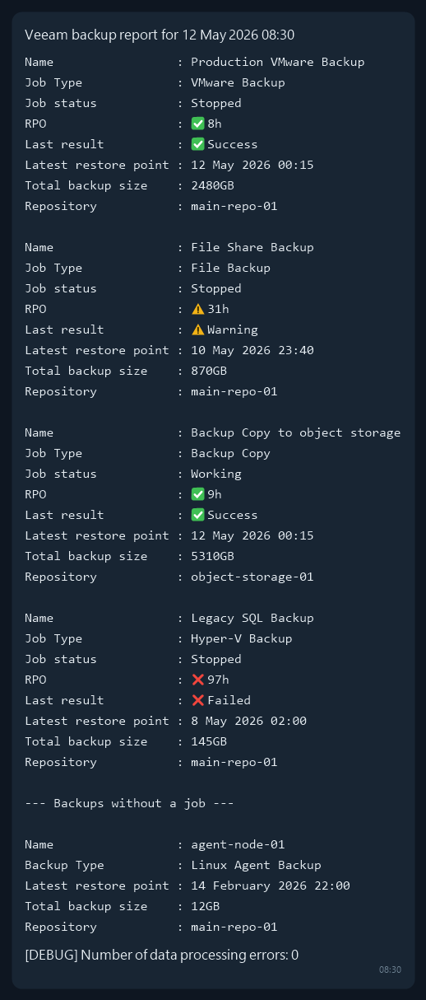

# VeeamReportToTelegram

PowerShell-скрипт для отправки отчётов о состоянии заданий бекапа Veeam Backup & Replication в Telegram.

Скрипт собирает статус всех заданий, посчитывает RPO (время с момента последней точки восстановления), формирует сводку и отправляет её сообщением в указанный Telegram-чат через бота.

## Пример отчёта



Для каждого задания в отчёт попадают:
- **Name** — имя задания
- **Job Type** — тип задания
- **Job status** — текущий статус (Working / Stopped / ...)
- **RPO** — время с момента последней точки восстановления, часы (со значком по цвету, см. ниже)
- **Last result** — результат последнего запуска (Success / Warning / Failed / None, со значком по цвету)
- **Latest restore point** — дата и время последней точки восстановления
- **Total backup size** — суммарный размер бекапов задания

Цветовые пороги для RPO и статуса заданы в скрипте и могут переопределяться индивидуально для конкретных заданий (см. [Кастомные пороги RPO](#кастомные-пороги-rpo)).

## Поддерживаемые типы заданий

- VMware Backup
- Hyper-V Backup
- File Backup (NAS/File Share)
- Backup Copy
- Hyper-V Backup Copy
- Linux Agent Backup

Остальные типы заданий обрабатываются по общему сценарию (дата последней точки восстановления берётся из `CreationTime` последнего бекапа).

## Требования

- Veeam Backup & Replication (скрипт использует командлеты модуля `Veeam.Backup.PowerShell`, который устанавливается вместе с VBR/консолью)
- PowerShell, запускаемый на сервере VBR (или на машине с установленной консолью VBR и правами на подключение к серверу)
- Telegram-бот и chat ID чата/канала, куда будут приходить отчёты

## Установка

1. Скопируйте `VeeamReport.ps1` и `VeeamReport.conf` на сервер, например в `C:\scripts\`.
2. Заполните `VeeamReport.conf` (см. ниже).
3. Запустите скрипт вручную, чтобы убедиться, что отчёт приходит в Telegram:
   ```powershell
   C:\scripts\VeeamReport.ps1
   ```
4. Настройте запуск по расписанию через Планировщик заданий Windows (Task Scheduler), например раз в сутки.

## Настройка (VeeamReport.conf)

```ini
TelegramBotToken=<токен вашего бота>
TelegramChatId=<ID чата или канала>
```

- `TelegramBotToken` — токен бота, полученный от [@BotFather](https://t.me/BotFather).
- `TelegramChatId` — ID чата/группы/канала, куда бот должен отправлять сообщения (бот должен быть добавлен в чат и иметь права на отправку сообщений).

По умолчанию скрипт ищет файл конфигурации по пути `C:\scripts\VeeamReport.conf`. Путь можно переопределить параметром при запуске:

```powershell
C:\scripts\VeeamReport.ps1 -ConfigPath "D:\Veeam\VeeamReport.conf"
```

## Кастомные пороги RPO

По умолчанию для всех заданий используется порог: RPO ≤ 24ч — зелёный, ≤ 48ч — жёлтый, больше — красный.

Для отдельных заданий (например, редко запускаемых архивных копий) можно задать собственные пороги в блоке `$CustomRPOMap` внутри `VeeamReport.ps1`:

```powershell
$CustomRPOMap = @(
    [PSCustomObject]@{JobName = 'Custom Backup';   RPOMap = [ordered]@{'168' = 'Green'; '336' = 'Yellow'}}
    [PSCustomObject]@{JobName = 'Custom 2 Backup'; RPOMap = [ordered]@{'9998' = 'Green'; '9999' = 'Yellow'}}
)
```

`JobName` должен точно совпадать с именем задания в Veeam.

## Известные ограничения

1. Возможно потребуется правка форматов даты — скрипт тестировался на Windows Server 2022 EN (язык профиля — английский США). На системах с другой локалью парсинг дат может отличаться.
2. В последней строке скрипта указываются токен Telegram-бота и ID чата — сейчас эти значения читаются из `VeeamReport.conf` (см. [Настройку](#настройка-veeamreportconf)).
3. Veeam неправильно сообщает дату последней точки восстановления для File Share бекапов: даже если задание завершилось неудачно (или было отменено), временем создания последней точки восстановления считается время завершения задания.
4. `Get-VBRJobTotalBackupSize` может считать размер некорректно, если существуют два задания, у которых имя одного полностью включает в себя часть имени другого.

## Лицензия

Лицензия не указана. Используйте на свой страх и риск.
